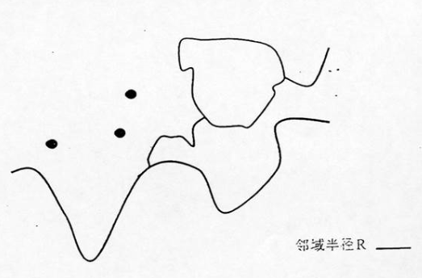
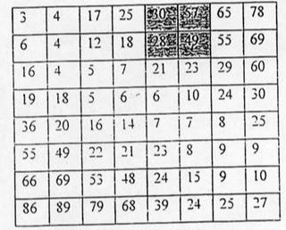
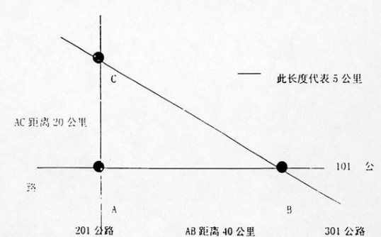
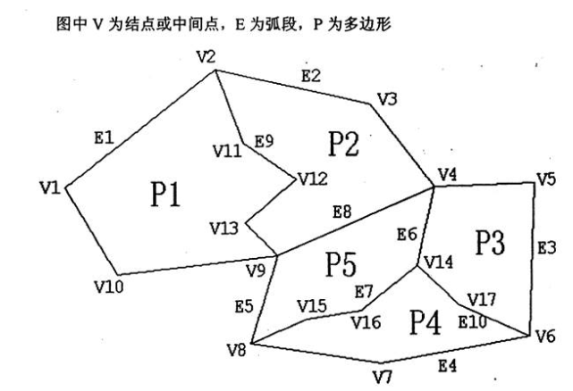
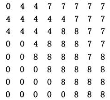
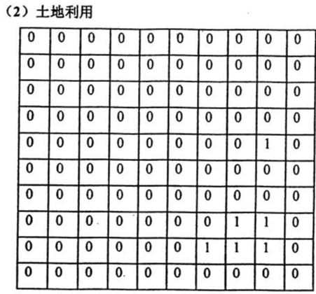
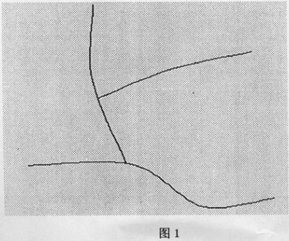

# PKU历年真题

## 1998

### 名词解释（4pt × 5）

1. 空间分析函数

2. GPS

   

3. 四叉树编码

   

4. 信息系统

   

5. OpenGIS

### 简答题 （10pt × 4）

1. 空间指标和空间关系量测的主要内容

   

   

2. 矢量多边形面积的快速算法（要求附框图）

   

   

3. DEM、DTM的概念及其获取方法

   

   

4. 由栅格数据向矢量数据转换的方法

   

### 综合分析题（20pt × 2）

1. 地理信息系统的意义、特点与发展趋势

   

   

   

   

   

   

2. 地理信息系统的信息源与输入方法

   

   

---

## 1999 ##

### 名词解释（4pt × 10） ###

1. 数字地球

   

2. 矢量结构

   

3. 栅格数据

   

4. 拓扑关系

   

5. 缓冲区分析（buffer）

   

6. 多边形覆盖分析（overlay）

   

7. 数字高程模型（DEM）

   

8. 三角法（TIN）

   

9. 元数据（Metadata）

   

10. 高斯-克吕格投影

### 简答题（8pt × 5） ###

1. 简述地理信息系统中有哪些空间分析方法

   

   

2. 简述地图投影的基本原理

   

   

3. 简述栅格数据的数据组织方法

   

   

4. 简述地理信息系统的主要软硬件组成

   

   

5. 简述地理信息系统工程的三维结构体系

   

   

   

### 论述题（20pt） ###

试论GIS项目中文档管理的意义及文档的类型（主要有哪些文档）？

---

## 2000 ##

### 名词解释（5pt × 8） ###

1. 国家信息基础设施

   

2. 空间对象（实体）

   

3. 拓扑结构

   

4. 元数据（Metadata）

   

5. 层次数据库模型

   

6. GIS互操作

   

7. 四叉树编码

   

8. 空间索引

### 简答题（8pt × 5） ###

1. 简述栅格数据结构的三种数据组织方法

   

   

2. 简述地理信息系统数据采集的方法及特点

   

   

3. 简述高斯-克吕格投影的基本特点

   

   

4. 简述GIS项目管理中文档的种类及重要意义

   

   

5. 间数据地理信息系统空间数据的误差来源

### 论述题（20pt） ###

试论网络GIS的技术特点以及尚需解决的问题

---

## 2001 ##

### 名词解释（5 in 6, 4pt × 5） ###

1. 空间对象

   

2. 拓扑空间关系

   

3. 地理空间中的栅格表达方法

   

4. 四叉树编码

   

5. 空间数据质量

   

6. 缓冲区分析

### 简答题（10pt × 4） ###

1. 地理信息系统组成

   

   

2. 矢量、栅格、DEM数据结构的优缺点分析

   

   

3. 属性数据库的数据模型

   

   

4. 空间数据的内插方法

### 综合分析题（20pt × 2） ###

1. 论述地理信息系统的数据来源以及数据采集的主要方法

   

   

   

   

   

   

   

   

2. 论述DEM的主要应用

---

## 2002 ##

### 名词解释（4pt × 5） ###

1. 扫描矢量化

   

2. TIN模型

   

3. 元胞自动机

   

4. 地理信息

   

5. WebGIS

### 简答题（8pt × 5） ###

1. 地理信息系统软件的体系结构与功能作用？

   

   

2. 地理信息系统的主要信息源有哪些？

   

   

3. 何谓BUFFER？并对以下图形单元（邻域半径长度如图所示）画出其BUFFER区示意图。

4. 请画出以下两个多边形图层的OVERLAY结果图层的示意图。

5. 何谓DEM？计算以下高程栅格数据（高程单位为米，栅格单元为正方形，其边长为10米）中的最大高程差及阴影部分的平均高程，同时在下图上示意性画出主要河流谷底边界线位置并计算河流纵比降系数。

### 综合分析题（20pt × 2） ###

1. 综述GIS空间数学模型的概念、类型与前沿问题

   

   

   

   

   

   

   

2. 试结合某实际领域（如环境、规划、交通、灾害等）进行GIS应用系统总体设计，并叙述项目实施主要步骤与要点（按照软件工程原理方法与应用项目组织管理规范描述主要结构、内容与流程）

---

## 2003 ##

### 名词解释（5pt × 6） ###

1. 空间分析函数

   

2. 矢量数据结构

   

3. 四叉树编码

   

4. OpenGIS

   

5. 虚拟现实

   

6. 数据挖掘

### 简答题或分析题（20pt × 6） ###

1. 空间指标和空间关系量测的主要内容？

   

   

2. DEM、DTM的概念及其获取方法？

   

   

3. 空间数据误差来源与数据质量控制方法？

   

   

4. 扫描矢量化的工作流程与关键算法？

   

   

5. GIS软件工程与项目管理的主要内容？

   

   

6. 下图中：点A、B、C分别为省级市、地级市与县级市，线101、201、301分别为国道、省道与普通道路。试根据以下条件进行经济开发区选址分析。

假设：开发区选址主要考虑离城市与道路的影响作用，且

1. 省级市对开发区的区位作用：15公里内很强，15-20公里内较强
2. 地级市对开发区的区位作用：5公里内很强，10公里内较强
3. 县级市对开发区的区位作用：5公里内较强
4. 国道对开发区的作用：5公里内很强，5-10公里内较强
5. 省道对开发区的区位作用：2.5公里内很强，2.5-5公里内较强
6. 普通道路对开发区的区位作用：2.5公里内较强

要求：表述分析方法、流程并画出评价结果示意图

---

## 2004 ##

### 名词解释（6pt × 5） ###

1. WebGIS

   

2. 信息系统

   

3. TIN

   

4. 属性数据

   

5. 元数据（Metadata）

### 简答题（15pt × 4） ###

1. 地理信息系统的主要信息源与输入方式

   

   

   

   

   

2. 对下图进行矢量数据拓扑结构编码（要写出结点、中间点、弧段，多边形的结构表，弧段的方向自行规定）

3. 试述栅格数据结构概念及主要编码方式，按以下数据举例说明

4. 比较矢量数据结构与栅格数据结构的特点并叙述其转换算法

### 综合分析题 ###

1. 以城市突发事件监控为例，给出数字城市应急响应系统设计。

   

   

   

   

   

   

   

   

   

2. 下图（1）为某区域高程栅格数据（高程单位为米，栅格单元为正方形，其分辨率为100米），图（2）为通过遥感处理获得的同一区域城镇用地现状栅格数据（代码1为现有城镇用地，代码0为其他）。

请根据以下条件进行用地规划并计算各类用地面积，预测洪水损失：（1）该区域常年地表水位为4.5m，五年一遇的洪水位为5.5m。（2）在保留现有城镇用地的基础上，优先安排扩展新的城镇用地，城镇用地要求坡度<5度，离现有城镇距离不大于100m，离常年水体距离不大于300m，同时不得有洪水威胁。（3）农田的规划要求是：坡度<5度，离常年水体距离不大于400m，（4）其余用地（除常年水体外）规划为林地。（5）农田的平均年产值为100万/平方公里，城镇区洪水淹没损失按1亿元/平方公里计。

请叙述GIS空间分析过程，画出流程与结果图。

（tan5=0.087）

---

## 2005 ##

### 名词解释（7 in 8, 6 pt × 7） ###

1. 不规则三角网（TIN）

   

2. WebGIS

   

3. 扫描矢量化

   

4. 空间数据挖掘

   

5. 场模型

   

6. 地理编码（Geocoding）

   

7. 基于位置的服务（LBS）

   

8. 元胞自动机（Cellular Automata）

### 简答题（14pt × 6） ###

1. 简述空间关系的类型及其特点。

   

   

2. 简述3D-GIS的特点，以及其与普通2D-GIS的区别。

   

   

3. 将遥感数据集成于GIS有哪些作用？

   

   

4. 空间数据误差来源与数据质量控制方法？

   

   

5. 简单说明扩展结构化查询语言（SQL）使其支持地理空间操作，对于地理信息系统软件开发的意义以及扩展关键技术

   

   

6. 举例说明GIS中的叠加复合分析及其应用

   

   

   

### 综合分析题（24pt） ###

如果要分析一个城市居民就医的方便程度，你准备采用哪些空间数据，并描述在一个GIS支持下的分析流程。

---

## 2006 ##

### 名词解释（5pt × 4） ###

1. 数据

   

2. 投影

   

3. WebGIS

   

4. 元数据

### 简答题（50pt） ###

1. 生成DEM的插值算法分类及其特点（15pt）

   

   

2. GIS的误差来源（10pt）

   

   

3. 地理信息的特点（10pt）

   

   

4. 地理信息系统的发展及趋势（15pt）

   

   

   

### 综合分析题（80pt） ###

1. 阐述缓冲区分析的定义、主要算法，并举例说明其应用（40pt）

   

   

   

   

   

   

   

   

2. 详细阐述二维地理信息系统的数据模型（40pt）

---

## 2007 ##

### 名词解释（5pt × 5） ###

1. 地理信息系统

   

2. 拓扑关联

   

3. 数据仓库

   

4. 元数据

   

5. 常规四叉树结构

### 简答题（55pt） ###

1. 地理信息系统软件工程中的需求分析（15pt）

   

   

2. 空间插值的数据源（15pt）

   

   

3. 地理信息的特点（10pt）

   

   

4. 包含分析的算法及应用（15pt）

   

   

   

### 综合分析题（70pt） ###

1. 二维地理信息系统矢量、栅格、TIN数据模型及其优缺点分析（20pt）

   

   

   

   

   

   

   

   

   

2. 图1中划线代表三条河流，请阐述生成缓冲区的算法（辅助绘图说明）（25pt）

3. 结合本专业方向或你将来攻读硕士学位所感兴趣的研究方向谈谈你对地理信息系统应用和发展趋势的认识。

---

## 2010 ##

### 名词解释（10pt × 5） ###

1. 元数据、数据和信息

   

2. RCL（游程长度编码）和块码

   

3. GPS、GNSS、LBS

   

4. WebGIS和Grid GIS

   

5. CAD、GIS

### 不定项选择题（2pt × 5） ###

1. 以下属于空间表达方法的是（ ）。

   A. 面向对象的表达方式

   B. 三次样条函数方法

   C. 趋势面方法

2. :page_facing_up:

3. :page_facing_up:

4. :page_facing_up:

5. GIS组成中，除了用户人员还包括（ ）。

   A. 地理数据

   B. 软件

   C. 硬件

### 综合分析题（30pt × 3） ###

1. 比较分析栅格数据模型和矢量数据模型的优缺点，并说明简单对象的矢量模型数据结构和各字段的含义。

   

   

   

   

   

   

   

   

2. 详细阐述DEM中的坡度和坡向分析过程，并绘图说明。

   

   

   

   

   

   

   

   

   

3. 在物联网和智慧地球的机遇和挑战下，说明你对地理信息系统未来应用和发展趋势的认识。

---

## 2011 ##

### 名词解释（6pt × 5） ###

1. 数据与信息

   

2. 拓扑关系

   

3. :page_facing_up:

4. 物联网

   

5. 矢量数据结构

### 简答题（15pt × 4） ###

1. :page_facing_up:

2. 简述空间索引的类型与作用

   

   

3. 简述地理信息系统的分类与发展趋势

   

   

4. 简述栅格数据向矢量数据转化的算法

   

   

   

### 综合分析题（30pt × 2） ###

1. 绘图阐述DEM的算法与应用

   

   

   

   

   

   

   

   

2. 从遥感和GIS结合的角度，说明舟曲泥石流灾害损失快速评估方案和分析流程

---

## 2012 ##

### 名词解释（5pt × 6） ###

1. 九交模型

   

2. 拓扑关系

   

3. 常规四叉树

   

4. 缓冲区分析

   

5. 智慧城市

   

6. 元数据

### 简答题（15pt × 4） ###

1. GIS的数据源及输入方法有哪些？

   

   

2. 什么是MBR？怎样计算？它的作用是什么？

   

   

3. 简述栅格数据向矢量数据转换的过程。

   

   

4. 应用GIS项目的工程建设过程和主要内容有哪些？

### 综合分析题（30pt × 2） ###

1. 论述GIS的发展历程及其未来发展的趋势。

   

   

   

   

   

   

   

   

2. 根据已有资料，进行关于植物适宜生长区域的分析。

---

## 2013 ##

### 名词解释（5pt × 6） ###

1. 八叉树模型

   

2. 空间数据库

   

3. 空间自相关

   

4. Delaunay三角剖分

   

5. R-树

   

6. 元数据

### 简答题（15pt × 4） ###

1. 简述地理信息系统数据质量的内容

   

   

2. 简述地理信息系统空间关系的基本类型

   

   

3. 给出一个森林火灾指数模型的公式，含有植被属性、高程、坡度、坡向、到居民地或者道路的距离等参数，现有纸质的等高线图和数字化的遥感图像，最后要得出森林火灾指数图。要求写出森林火灾指数图的数据处理和计算过程。

   

   

4. 绘制地理信息系统软件平台体系结构并简述各部分主要内容。

   

   

   

### 综合分析题（30pt × 2） ###

1. 目前北京的出租车上都安装了GPS系统，假设可以连续获得三维坐标，那么我们可以用这些数据进行哪些空间分析和应用。

   

   

   

   

   

   

   

   

   

2. 选择一个行业，以“智慧××”（如智慧国土、智慧矿山）作为题目，谈谈你的理解。

---

## 2017 ##

### 名词解释 ###

1. 链码

   

2. 线性参考系统

   

3. TIN

   

4. 3DGIS

   

5. 空间数据库

### 简答题 ###

1. :page_facing_up:

2. 矢量线压缩算法

   

   

3. 克里金插值原理及方法

   

   

4. 写出三个有关现象对周围邻域影响的空间分析

   

   

   

### 综合分析题 ###

1. 给出地理围栏的说明，然后给出设计地理围栏的数据组织方式、涉及到的算法以及软件结构

   

   

   

   

   

   

   

   

   

   

2. 对地理大数据的看法以及举例

---

