# 地理信息系统原理复习笔记

## 地理信息系统概论

### 基本概念

#### 数据与信息

信息：向人们或机器提供关于现实世界新的事实的知识，是数据、消息中所包含的意义，它不随载体物理设备形式的改变而改变。

信息的特点：

1. 客观性：任何信息都是与客观事实紧密相关的，这是信息正确性和精确度的保证。
2. 实用性：信息对于决策非常重要，信息系统将地理空间的巨大数据流收集、组织与管理起来，经过处理、转换和分析变为对生产、管理和决策具有重要意义的有用信息。
3. 传输性：信息可以在信息发送者和接受者之间传输，既包含系统把有用信息送至终端设备（包括远程终端）和以一定的形式或格式提供给有关用户，也包括信息在系统内各个子系统之间的流转与交换。
4. 共享性：信息与实物不同，信息可以传输给多个用户，为多个用户共享，而其本身并无损失。

数据：指某一目标定性、定量描述的原始资料，包括数字、文字、符号、图形、图像以及它们能转换成的数据等形式。

**:star:地理数据**：表征地理圈或地理环境固有要素或者物质的数量、质量、分布特征、联系和规律的数字、文字、图像和图形的总称。地理数据使各种地理特征和现象之间关系的符号化表示，包括**空间位置**、**属性特征**和**时态特征**三部分。

1. 空间位置数据

   - 描述地物所在位置——依照大地参照系定义
   - 定义地物间的相对位置关系——描述空间上的距离、邻接、重叠、包含等

2. 属性数据

   非空间数据，属于一定地物、描述其特征的定性或者定量指标，即描述了信息的非空间组成部分，包括语义和统计数据。

3. 时态特征

   地理数据采集或者地理现象发生的时刻或时段，时态数据对环境模拟分析非常重要。

**:star:地理信息**：有关地理实体的性质、特征和运动状态的表征和一切有用的知识，是对地理数据的解释。

1. 区域性：通过经纬网等建立的地理坐标来实现空间位置的标识。
2. 多维结构性：在二维空间的基础上实现多专题的第三维结构。
3. 动态变化性：地理信息的时序特征非常明显，可以有时间尺度、空间尺度等上的变化。

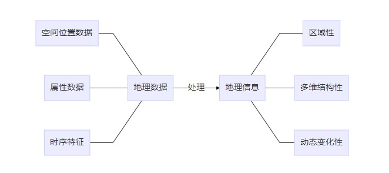

:arrow_right:地理现象：发生在地理空间中的地理事件特征要素，具有空间位置、空间关系和属性随时间变化的特性。

:arrow_right:地理空间实体：具有地理空间参考位置的地理实体特征要素，具有相对固定的空间位置和空间相关关系、相对不变的属性变化、离散属性或连续属性取值的特征。

:arrow_right:空间对象：地理空间实体和地理现象在空间或时空信息系统中的数字化表达方式。

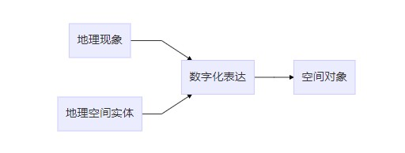

#### 信息系统

信息系统：具有数据采集、管理、分析和表达数据能力的系统，能够为单一的或有组织的决策过程提供有用的信息。

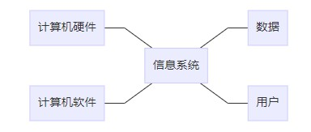

- 计算机硬件

  各类计算机处理以及终端设备，它帮助人们在非常短的时间内处理大量数据、存储和快速获取帮助。

- 计算机软件

  支持数据信息的采集、存储加工、再现和回答用户问题的计算机程序软件，它接受有效数据并正确处理数据；在一定的时间内提供适用的、正确的信息；并存储信息为将来所用。

- 数据

  系统分析与处理的对象，构成系统的应用基础。

- 用户

  信息系统所服务的对象。由于信息系统并非完全自动化，在系统中总是包含一些人的复杂因素，人的作用是输入数据、使用信息和操作信息系统，建立信息系统需要人的参与。

信息系统类型：

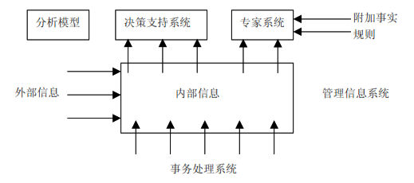

1. **事务处理系统**（Transaction Process System, TPS）

   主要用以支持操作人员的日常活动，它主要负责处理日常事务。

2. **管理信息系统**（Management Information System，MIS）

   需要包含组织中的事务处理系统，并提供了内部综合形式的数据，以及外部组织的一般范围与大范围的数据。

3. **决策支持系统**（Decision Support System，DSS）

   能够从管理信息系统中获得信息，帮助管理者制定好的决策。该系统是一组处理数据和进行推测的分析程序，用于支持管理者制定决策，基于计算机的交互式信息系统，由<u>分析决策模型</u>、<u>管理信息系统中的信息</u>、<u>决策者的推测</u>三者相结合达到好的决策效果。

4. **人工智能和专家系统**（Expert System，ES）

   专家系统能够模仿人工决策处理过程的基于计算机的信息系统，其扩大了计算机的应用范围，使其从传统的资料处理领域发展到智能推理。专家系统由五个部分组成——知识库、推理机、解释系统、用户接口和知识获得系统。

### :six_pointed_star:地理信息系统
#### 地理信息系统 ####
:star:地理信息系统（Geo-spatial Information System）定义

（武大）地理信息系统是对地理空间实体和地理现象特征要素进行获取、处理、表达、管理、分析、显示和应用的计算机空间或时空信息系统。

（北大）地理信息系统定义由两个部分组成：

1. **地理信息系统（科学）是一门学科，是描述、存储、分析和输出空间信息的理论和方法的一门新兴交叉学科。**
2. **地理信息系统是一个技术系统，是以地理空间数据库（Geospatial Database）为基础，采用地理模型分析方法，适时提供多种空间的和动态的地理信息，为地理研究和地理决策服务的计算机技术系统。**

:star:地理信息系统与其他信息系统的区别

地理信息系统与其他信息系统的主要区别在于**(1) 其存储和处理的信息是经过地理编码的，地理位置及该位置有关的地物属性信息成为信息检索的重要部分。(2) 现实世界被表达为一系列的地理要素和地理现象，这些地理特征至少由空间位置参考信息和非位置信息两个组成部分。**

:star:地理信息系统特征
（北大）
1. **具有采集、管理、分析和输出多种地理信息的能力，具有空间性和动态性。**
2. **由计算机系统支持进行空间地理数据管理，并由计算机程序模拟常规的或专门的地理分析方法，作用于空间数据，产生有用信息，完成人类难以完成的任务。**
3. **计算机系统的支持是地理信息系统的重要特征，因而使得地理信息系统能以快速、精确、综合地对复杂地地理系统进行空间定位和过程动态分析。**

（武大）
1. 以计算机系统为支撑
2. 操作对象为空间数据
3. 具有对地理空间数据进行空间分析、评价、可视化和模拟的综合利用优势
4. 具有分布特性
5. 其成功应用更加强调组织体系和人的因素的作用，这是由地理信息系统的复杂性和多学科交叉性所要求的。

#### 地理信息系统类型 ####

1. 专题地理信息系统（Thematic GIS）
具有有限目标和专业特点的地理信息系统，为特定的专门目的服务。

2. 区域信息系统（Regional GIS）
以区域综合和全面的信息服务为目标，可以有不同的规模（国家级、地区、市级、县级）

3. 地理信息系统工具或地理信息系统外壳（GIS Tools）
一组具有图形图像数字化、存储管理、查询检索、分析运算和多种输出等地理信息系统基本功能的软件包。

#### :point_right:地理信息系统构成 ####

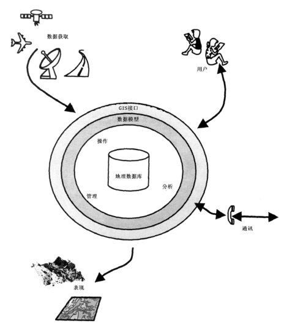

:star:（北大）

1. 计算机硬件系统（核心）

   计算机系统中的实际物理装置的总称，系统的规模、速度、功能、形式、使用方法甚至软件都受到硬件指标的支持或制约，由于GIS系统任务的复杂性和特殊性，必须由计算机设备支持。

   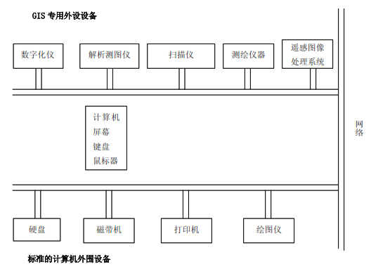

2. 计算机软件系统（核心）

   对GIS而言必需的各种程序。

   - 计算机系统软件

     由计算机厂家提供的、为哦农户使用计算机提供方便的程序系统，通常包括操作系统、汇编程序、编译程序、诊断程序、库程序以及各种维护使用手册、程序说你等，是GIS日常工作必需的。

   - 地理信息系统软件和其他支持软件

     包括通用的GIS软件包，也可以包括数据库管理系统、计算机图形软件包、计算机图像处理系统、CAD等，用于支持对空间数据输入、存储、转换、输出和用户接口。:key:

     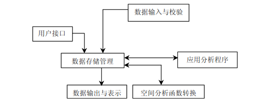

   - 应用分析程序

     系统开发人员或用户根据地理专题或区域分析模型编制的用于某种特定应用任务的程序，是系统功能的扩充与延伸。应用程序作用于地理专题或区域数据，构成GIS的具体内容，这是用户最为关心的用于地理分析的部分，也是从空间数据中提取地理信息的关键。

3. 系统开发、管理和使用人员-决定系统的工作方式和信息表示方式

   人是GIS中的重要的构成因素，GIS是一个动态的地理模型，需要人进行系统组织、管理、维护和数据更新、数据扩充完善、应用程序开发，并灵活采用地理分析模型提取多种信息，为研究和决策服务。

   

4. （地理）空间数据-反映GIS的地理内容:star:

   以地球表面位置为参考的自然、社会和人文经济景观数据，可以是图形、图像、文字、表格和数字等，其是由系统建立者通过数字化仪、扫描仪、键盘、磁带机或其他系统通讯输入GIS，是系统程序作用的对象，是GIS所表达的现实世界经过模型抽象的实质性内容。

   - 某个已知坐标系中的位置

     即几何坐标，标识地理景观子啊自然界或包含某个区域的地图中的空间位置，采用数字化仪输入时通常采用数字化仪直角坐标系或屏幕直角坐标。

   - 实体间的空间关系

     1. 度量关系
     2. 延伸关系（方位关系）-两个地物之间的方位
     3. 拓扑关系

   - 与几何位置无关的属性

     非几何属性或属性，是与地理实体相联系的地理变量或地理意义，**其主要是经过抽象的概念，通过分类、命名、量算、统计得到**，地理信息系统的**分析、检索和表示主要通过属性的操作运算实现**。

     1. 定性-名称、类型、特性等
     2. 定量-面积、长度、等级等

（武大）

1. 计算机硬件系统
2. 计算机软件系统
3. 空间数据
4. 空间分析
5. 人员

### 地理信息系统功能概述

#### 地理信息系统的核心问题

1. 位置（Locations）

   在某个特定的位置有什么

   方法：定义某个物体或者地区信息的具体位置（交互手段或者直接输入坐标获取）→预期的结果以及所有或部分特性

2. 条件（Conditions）

   什么地方有满足这些条件的东西

   方法：指定一组条件→获得满足指定条件的所有对象的列表

3. 变化趋势（Trends）

   综合现有数据，以识别已经或者正在发生的地理现象。

   方法：确定趋势（依赖于假设条件、个人推测、观测现象或者证据报道）→针对趋势对数据进行分析，对该趋势加以确认或否定

4. 模式

   分析与已经发生或正在发生事件有关的因素。

   确定模式（需要长期的观察、熟悉现有数据、了解数据间的潜在关系）→确定后获得报告（说明该事件发生在何时何地、显示事件发生的系列图件）

5. 模型

   建立新的数据关系以产生解决方案

   建立一个或者多个模型→产生能够满足特定的所有特征的列表，并着重显示被选择特征的地图，而且提供一个有关选择的特征详细描述的报表。

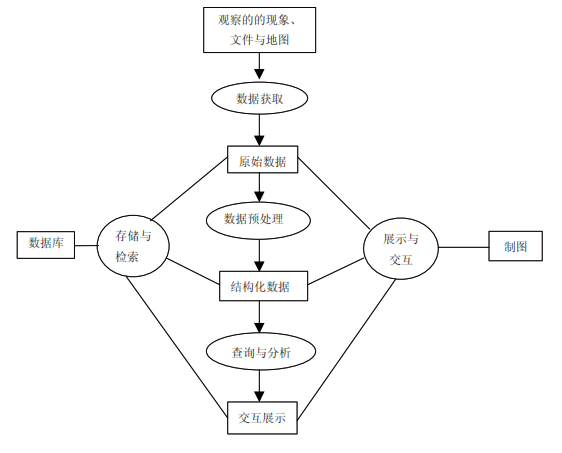

#### 地理信息系统功能

**数据获取**是从现实世界的观测、以及从现存文件、地图中获取数据。已经数字化的数据往往需要通过**数据预处理**转化为结构化的数据，以使其能被系统查询和分析。**数据查询分析**是求取数据的子集或对其进行转换。**数据存储与检索**以及**交互表现**贯穿了地理信息系统数据处理的始终。

`空间信息处理和分析的六个部分[丁跃民]`

`1）空间操作，如地图的并、交、差，缓冲区计算等`

`2）空间统计分析，用于描述和分析空间数据的关系，如空间自相关分析`

`3）空间模型，注重于空间现象、空间结构、空间关系和空间位置的分析，如网络分析和水系生成等`

`4）空间表现/可视化，侧重于表达空间信息`

`5）空间数据库管理，包括空间数据库设计、空间数据结构、空间数据管理与空间查询`

`6）空间模型库管理，包括为空间决策支持系统提供模型的管理`

（北大）

1. **数据采集、监测、编辑**

   主要用于获取数据，保证地理信息系统数据库中的数据在内容与空间上的完整性、数值逻辑一致性与正确性等。**地理信息系统数据库的建设占整个系统建设投资的70%或更多，且这种比例近期内不会改变。**<u>信息共享与自动化数据输入成为**地理信息系统研究的重要内容**。</u><u>自动化扫描输入与遥感数据集成**最为人们所关注**。</u><u>扫描技术的应用与改进，实现扫描数据的自动化编辑于处理仍是地理信息系统数据获取研究的主要**技术关键**。</u>

2. **数据处理**

   包括**数据格式化**、**数据转换**、**数据概括**。

   1. 数据格式化

      **不同数据结构间的数据间变换**，是一种耗时、易错、需要大量计算量的工作，<u>应该尽量避免</u>。

      类型：

      1. 数据格式转化

         不同数据格式之间的转换

   2. 数据转换

      1. 数据格式转换

         **矢量到栅格的转换要比其逆运算快速、简单**。

         例如shp转换成img

      2. 数据比例尺变化

         涉及数据比例尺缩放、平移、选择等方面，其中最为重要的是投影变换

      3. 制图综合

         数据平滑、特征集结等。

   3. 数据概括

      地理信息系统目前数据概括功能较弱，与地图综合的要求还有较大的差距。

3. **数据存储与组织**

   空间数据和属性数据的组织。

   栅格模型、矢量模型或者栅格/矢量混合模型是**常用的空间数据组织方法**。

   空间数据结构的选择一定程度上决定了系统所能执行的数据与分析功能。

   **地理数据组织与管理中，最为关键的是如何将空间数据与属性数据融合为一体**。而目前大多数系统将二者分开存储，通过公共项连接，缺点在于<u>数据的定义与数据操作分离，无法有效记录地物在时间域上的变化属性</u>。

4. **空间查询与分析**

   **空间查询**是地理信息系统以及许多其他自动化地理数据处理系统应具备的**最基本的分析功能**；**空间分析**是地理信息系统的核心功能，也是地理信息系统与其它计算机系统的**根本区别**，**模型分析**是在地理信息系统支持下，分析和解决现实世界中与空间相关的问题，它是地理信息系统应用深化的重要标志。

   <u>空间分析的三个层次</u>：

   1. 空间检索

      从空间位置检索空间物体及其属性和从属性条件集检索空间物体。

      1. **空间索引**：空间检索的关键技术-如何有效地从大型的地理信息系统数据库中检索出所需的信息，将影响地理信息系统的分析能力。
      2. 空间物体的图形表达：同时也是空间检索的重要部分。

   2. 空间拓扑叠加分析

      输入要素属性的合并（Union）以及要素属性在空间上的连接（Join）。

      空间拓扑**本质**是空间意义上的布尔运算。

   3. 空间模型分析

      空间模型分析研究可分为三类：

      1. 地理信息系统外部的空间模型分析，将地理信息系统当作一个通用的空间数据库，而空间模型分析功能则借助于其它软件
      2. 地理信息系统内部的空间模型分析，试图利用地理信息系统系统软件来提供空间分析模块以及发展适用于问题解决模型的宏语言。（基于空间分析的复杂性与多样性，易于理解和应用，由于GIS空间分析功能限制，紧密结合的空间模型分析方法实际比较少用）
      3. 混合型的空间模型分析，其宗旨在于尽可能地利用地理信息系统所提供的功能，同时也充分发挥地理信息系统使用者的能动性。

5. **图形与交互显示**

   地理信息系统提供了众多用于地理数据表现的工具，其形式既可以是**计算机屏幕显示**，也可以是诸如报告、表格、地图等**硬拷贝图件**G，最为强调的是GIS的**地图输出功能**。

### 地理信息系统的研究内容

#### 研究内容 ####

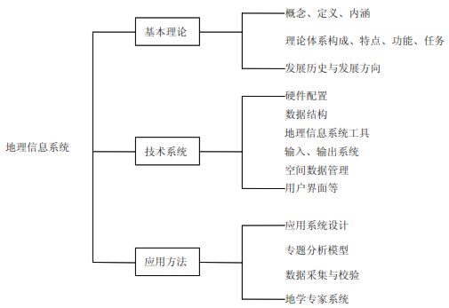

##### 内容

- 有关的计算机软/硬件
- 空间数据的获取及计算机输入
- 空间数据模型及数字表达
- 数据的数据库存储及处理
- 数据的分享、分析与应用
- 数据的显示与视觉化
- 地理信息系统的网络化

##### 基本理论

- 地理信息系统的概念、定义与内涵
- 地理信息系统的信息论研究
- 建立地理信息系统的理论体系
- 研究地理信息系统的构成、功能、特点和任务
- 总结地理信息系统的发展历史
- 探讨地理信息系统发展方向

##### 技术系统设计

- 地理信息系统硬件设计与配置
- 地理空间数据结构及表示
- 输入及输出系统
- 空间数据库管理系统
- 用户界面与用户工具设计
- 地理信息系统工具软件研制
- 微机地理信息系统的开发
- 网络地理信息系统的研制

##### 应用方法研究

- 系统设计和实现方法
- 数据采集和校验
- 空间分析函数与专题分析模型
- 地理信息系统与遥感技术结合方法
- 地学专家系统研究

#### 相关学科

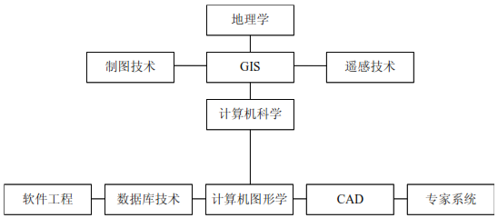

### GIS的发展展望

#### 亟待解决的问题

GIS将会向集成化和智能化方向发展：

1. 图形数据与属性数据的结合（两者的完全结合）[在空间数据库中属性数据和空间数据已经存储于同一条记录内，已经完成了两者的整合]

2. GIS与RS的结合-遥感是地理信息系统中重要的数据源和数据更新的手段。分开但是平行的结合→表面无缝的结合→整体的结合

3. GIS与GPS与CCD技术的结合。

   GPS：与GIS相结合可以实现电子导航，用于交通管理、公安侦破、自动导航，也可以做GIS实时更新。

   CCD：与CCD结合可以实现GIS运行系统，可以用于公路、铁路线路状况的自动监测与管理。

4. GIS与专家系统（ES，Expert System）的结合。

亟待解决的问题：

1. GIS设计与实现的方法学问题
2. GIS的功能问题
3. 多媒体地理信息系统的管理与操作问题
4. GIS地理现象的深加工问题
5. 空间信息可视化技术与虚拟现实技术（VR)

#### 发展动态

发展的热点

1. GIS中面向对象技术研究

   - 优势
     - 所有地物以对象形式封装，而非复杂的关系形式，系统组织结构良好、清晰
     - 以对象为基础，消除了分层的概念
     - 面向对象的**一般——特殊结构**与**整体——部分结构**使GIS可以直接定义和处理复杂的地物类型
     - 根据面向对象后期绑定（Late-binding）的思想，用户可以在现有抽象数据类型和空间操作箱上定义自己所需的数据类型和空间操作方法，增强系统的开发性和可扩充性。
     - 基于图标的面向对象用户界面，便于用户操作额使用
   - 问题
     - 大对象的操作受硬件条件限制
     - 对象的独立性与粒度问题
     - 矢量和栅格数据统一的、支持动态拓扑结构和复合对象表示的面向对象的数据结构问题

2. 时空系统→参考**《地理信息系统前沿》**

   处理时间维（系统时间、数据库时间）：GIS中处理发生的时间

   有效时间维（事件时间、实际时间）：实际应用领域事件出现的时间。

3. 地理信息建模系统（GIMS-Geographic Information Modeling System）

   研究动向→面向对象在GIS中的应用，图标化显示，建立模型（二次开发对用户来说有一定难度）

4. 三维地理信息系统的研究→参考**《地理信息系统前沿》**

   三维GIS是许多应用领域对GIS的基本要求。

   主要研究方向：

   - <u>三维数据结构的研究</u>
     - 数据的有效存储
     - 数据状态的表示
     - 数据的可视化
   - <u>三维数据的生成与管理</u>
   - <u>地理数据的三维显示</u>
     - 三维数据的操作
     - 表面处理
     - 栅格图形、全息图像显示
     - 层次处理

发展趋势与展望

1. GIS网络化
2. GIS标准化
3. 数据商业化
4. 系统专门化
5. GIS企业化
6. GIS全球化
7. GIS大众化

## 从现实世界到比特世界 ##

地理信息科学的研究领域

1. 地理认知模型的研究
2. 地理概念计算方法的研究
3. 地理信息与社会的研究
   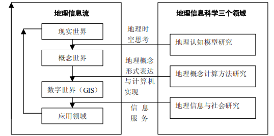

### 对现实世界的地理认知 ###

#### 何为认知 ####

**认知模型**
“刺激-反应”关系模式➡️心理-物理反应
**认知目的**
求解问题，即找到问题的解决方案
**认知操作**

- 常规问题求解
- 创造性问题求解
  **可视化的实质**
  地图制图可视化的**实质**是探讨地图信息过程中人对空间实体的认识。
  **空间中认知的概念**
  ~根据空间信息分析与空间信息可视化的需要，认知应该是知觉、注意、表象、记忆、学习、思维、语言、概念形成、问题求解、情绪、个性差异等有机联系的信息处理过程~ 。
  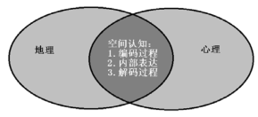
  地理信息系统就是**信息加工系统**，即输入信息、进行编码、存储记忆、做出决策、输出结果。

#### 环境映象与模型 ####

环境映象是被学习到的稳定的思维概念，总结了人类对环境的认识、评价和选择能力。
**研究方法**
环境映象研究中最为普遍的方法是绘制描述环境要素的简图，通过描述环境要素序列、要素之间的联系与差异、映象的类型、细节和规模变化来提供信息，即**构造模型**。
地理学中的采用的表现模型以**地图**最为普遍和重要，地图是客观世界的形象/符号/概括模型，单幅地图是模拟客观实际的某一方面的模型，而系列地图与地图集属于高层次的模型，即地理系统的模型，其模拟的是自然要素和社会经济要素的总体，反映出这些要素的相互联系、相互作用、解析特征与综合效果、现状与未来发展趋势，以及其所形成的复杂巨系统的功能特征等。

#### 地图认知模型 ####

**类型**

- 地图编制与设计者的认知模型
  - **强调**对所表达事物与现象的认知以及对表达内容的表现形式的认知。
  - **目的**是指导制图者选取最主要的制图内容与最适合的表现形式，以高效地传输空间信息。
- 地图使用者的认知模型
  - 在已有地图的基础上，结合读图者自身的空间知识与背景，完成对地图对象的认知，从而间接达到认知客观世界的目的。

#### 地理客体的科学认知 ####

1. 地理认知是地理信息传输过程中的一个子系统。
   - 其偏重于心理感知与分析，认知者既感知图上明显的信息也挖掘潜在的信息，不仅仅是探测、识别或区分信息，更要主动地解译信息，形成对客观世界的整体认识。
2. 地理认知是制图概括的基础
   - 在地理认知的基础上对真实世界的信息进行抽象和概括，形成地理信息系统中的模型，在一定比例尺下现实地理要素的分类、分级和空间图形格局。
3. 地理认知贯穿于制图概括的整个过程

#### 地图——客观世界的形象-符号-概括模型 ####

1. 地图是客观世界的形象模型
   - 地图具有形象性的优点，能够对实际对象做出完整的、清晰的、直观的图形描述和说明。
2. 地图是客观世界的符号模型
   - 地图采用专门设计和事先规定的符号来反映地物、现象和地理过程并表示它们的位置、质量特征与数量特征。
   - 各种符号的组合构成一种地图形象
   - 多种地图形象汇集组成一幅完整的地图图形
   - 地图符号不仅仅可作为传输信息的介质，还是记录知识并使知识定型并系统化的强大工具。
3. 地图是客观世界的概括模型
   - 地图并非客观对象的完全再现，其是经过筛选、概括和抽象而来的模型。
   - <u>对制图对象进行地图概括是地图作为客观实际模型的一个最重要的特征。</u>

#### 现实世界的抽象 ####

对地理对象的抽象过程包含9个层次，9个层次通过8个接口进行连接，定义了从现实世界到地理要素集合世界的转换模型。
9个层次：
**现实世界的抽象**

1. 现实世界-Real world
   - 所有事物的集合，无论人们是否知道这些事物。
2. 概念世界-Conceptual world
   - 人类自然语言的世界，人类了解且认识其所命名的事物。
3. 地理空间世界-Geospatial world
   - 抽象的、几乎具有卡通特性的世界，消除了概念世界所具有的复杂性，以简单浅显的静态的抽象取而代之。
4. 维度世界-Dimensional world
   - 地理空间世界的一个抽象，其中包括一些测量工具，是现实世界抽象的最后一个。
5. 项目世界-Project world
   - 只发生于一个具体的实现之中，每一个实现都是针对一个特殊的GIS学科或分学科。
   - 地理空间要素建模
     1. 几何体要素（Feature with geometry）-定义了点线面的一个要素的空间范围，以及来自于熟知的一系列类型的几何基本单元。
        - 用于对现实世界中的地物对象建模
        - 具有多种属性
     2. 覆盖（Coverage）-影像是其特例。
        - 对现象建模
   - 地理信息团体
     - 共享数据的用户群，分属不同专业领域，既可以是数据使用者，也可以是数据提供者。
       **真实世界的数学与符号化模型**
6. 点世界-Point world
7. 几何体世界-Geometry world
8. 地理要素世界-Feature world
9. 要素集合世界-Feature collection world
   8个接口：
10. 认识接口-Epistemic
11. GIS学科接口-GIS discipline
12. 局部测度接口-Local Metric
13. 信息团体接口-Community
14. 空间参照系-Spatial reference
15. 几何体结构接口
16. 要素结构接口
17. 项目结构接口
    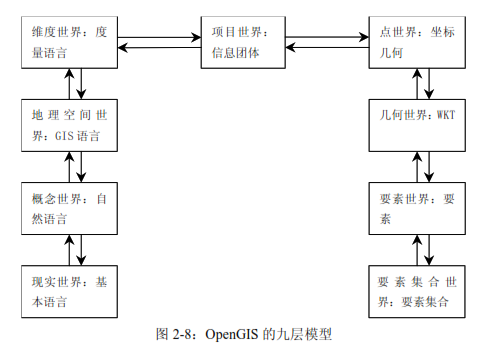

### 比特世界（二进制形式） ###

地理信息系统以数字世界表示自然世界。
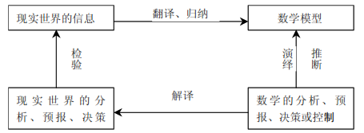
**模型**
对现实世界的简化表达，是将系统的各个要素通过适当的筛选，用一定的表现规则描写出来的简明的映象。
一幅地图是一个符号模型，因为其是通过制图学家处理后得到现实世界的简化描述；存储数字地图的计算机文件也是一种符号模型，以数字代码来表现图形符号。
一幅数字地图的产生不仅需要选择所要表现的物体，还要进一步考虑如何对表达它们的数据进行组织。
**数据建模**
把现实世界的数据组织为有用且能反映真实信息的数据集的过程。
**数据建模过程**

1. 选择一种数据模型对现实世界的数据进行组织
2. 选择一种数据结构表达该数据模型
3. 选择一种适合于记录该数据结构的文件格式
   **模型的作用**
4. 有效帮助人们从各种因素之间找出因果关系或者联系，有利于问题的解决
5. 大量模型的发展与应用实际上集中和验证了某个应用领域中许多专家的经验与知识，成为了一般地理信息系统向专家系统发展的基础。

#### GIS空间数据的建模 ####

**基本任务**
针对所研究的空间现象或问题，描述GIS的空间组织，设计GIS空间数据库模式（定义空间实体及其相互间关系，确定数据实体或目标及其关系），设计在计算机中的物理组织、存储路径和数据库结构等。

- GIS空间概念数据模型

  - 实体及实体间联系的抽象概念集
  - 考虑用户需求的共性，用统一的语言描述和综合、集成各用户视图
  - 数据模型
    1. 基于平面图的矢量数据模型
    2. 基于连续铺盖的栅格数据模型
- 逻辑数据模型

  - 概念数据模型中数据实体及其间关系
  - 根据前述概念数据模型确定的空间数据库信息内容（空间实体及相互关系），具体表达数据项、记录等之间的关系。
  - 数据模型
    1. 结构化逻辑数据模型
       - 显式表达数据实体之间关系的树形结构
       - ::优点::是能反映现实世界中极为常见多对多联系
       - ::缺点::是复杂
    2. 面向操作的逻辑数据模型
       - 用二维表格表达数据实体之间的关系， ~用关系操作提取或查询数据实体之间的关系~
       - ::优点::是灵活简单
       - ::缺点::是表达复杂关系比其他数据模型困难，且当数据构成多层联系时，存储空间利用效率较低。
- 物理数据模型

  - 数据在计算机中的物理组织、存储路径和数据库结构
  - 物理表示与组织
    - 考虑要素：如何在外存储器以最优的形式存放数据，通常要考虑操作效率、响应时间、空间利用和总的开销。
    - 层次逻辑数据模型
      1. 物理邻接法
      2. 表结构法
      3. 目录法
    - 网络数据模型
      1. 变长指针法
      2. 位图法
      3. 目录法
    - 关系数据模型
      - 关系表
  - 空间数据存取
    - `存`是从内存写到另一块外存
    - `取`是从外存写一段到内存
    - 存取方法
      1. 文件结构法
         - 顺序结构
         - 表结构
         - 随机结构
      2. 索引文件
      3. 点索引结构

## 空间数据模型 ##

**地理空间**：物质、能量、信息的存在形式在形态、结构过程、功能关系上的分布方式和格局及其在时间上的延续。
**地理空间类型**：

1. 绝对空间
   - 具有属性描述的空间位置的集合，由一系列不同位置的空间坐标值组成
2. 相对空间
   - 具有空间属性特征的实体的集合，由不同实体间的空间关系构成
     **空间数据（地理数据）**：以不同方式和来源获取的数据，如地图、各种专题图、图像、统计数据等，这些数据都具有能够确定空间位置的特点。
     **空间数据模型**：关于现实世界中空间实体及其相互间联系的概念，它为描述空间数据的组织与设计空间数据库模式提供了基本方法。
     **空间数据模型的类型**：
3. 基于对象（要素，Feature）的模型
   - 强调离散对象，根据其边界线以及组成它们或与它们相关的其他对象，可以详细描述离散对象。
4. 网络（Network）模型
   - 表示特殊对象之间的交互
5. 场（Field）模型
   - 表示二维或三维空间中被看作是连续变化的数据
     **空间数据模型的学术前沿**

> 1. 时空数据模型  
>
> - 属性变化，空间坐标或位置不变
> - 空间坐标或位置变化，属性不变
> - 空间实体或现象的坐标和属性都发生变化
>
> 2. 三维空间数据模型  
>
> - 三维矢量模型-利用一些基元及其组合表示三维空间目标，而其本身可以用数学解析函数描述
> - 体模型-以体元（voxel）模型为代表，易于表达三维空间属性的非均衡变化，但是所占存储空间大、处理时间长
>
> 3. 分布式空间数据模型  
>
> - 分布式空间数据库管理系统-将空间数据库技术与计算机网络技术结合，利用计算机网络对通过通讯线路相关联的空间数据库进行数据和程序的分布处理，以实现集中与分布的统一，即将分散的数据库连成一体。主要的问题是空间数据的分割、分布式查询、分布式并发控制
> - 联邦空间数据库（Federated spatial database）-在不改变不同来源的各空间数据库管理系统的前提下，将非均质的空间数据库联成一体，形成联邦式的空间数据库管理体系，并向用户提供统一的视图。
>
> 4. CASE工具-计算机信息系统结构化分析、数据流程描述、数据实体关系表达、数据字典与系统原型生成、原代码生成的重要工具，在非空间型计算机系统的设计与建立中有较广泛的应用。  

### 场模型 ###

对于**模拟具有一定空间内连续分布特点的现象**是较为合适的。
场可分为二维场和三维场，对于1任意场来说，场中任意地点或位置都有一个值。
**场模式的数学表示：**

**场的特征**

场经常被视为由一系列等值线组成，一个等值线就是地面上所有具有相同属性值的点的有序集合。

1. 空间结构特征与属性域
   - 空间结构
     1. 空间结构可以是规则或不规则的
     2. 空间结构的分辨率和位置误差十分重要
     3. 应当与空间结构设计所支持的数据类型和分析相适应
   - 属性域
     1. 包含**名称、序数、间隔、比率**等类型
     2. 支持空值，若值位置或不确定时赋空值
2. 连续的、可微的、离散的
3. 与方向无关的和与方向有关的（各向同性和各向异性）
   - 空间场内部的各种性质是否随方向的变化而发生变化
   - 若场内所有性质与方向无关，则为各向同性场（isotropic field），反之则为各向异性场（anisotropic field）。
     
4. 空间自相关

- 空间场中的数值聚集程度的一种度量，描述了某一位置上的属性值与相邻位置上的属性值之间的关系。
- **距离近的事物之间的联系性强于距离远的事物之间的联系性**。
- 若空间场中类似的数值有聚集的倾向，则该空间场便表现出很强的正空间自相关，若类似属性值在空间上有相互排斥的倾向，则表现为负空间自相关。

#### 🧀栅格数据模型 ####

##### 栅格数据模型特征 #####

1. 栅格数据属于场模型的一种
2. 基于连续铺盖，是将连续空间离散化，即用二维铺盖或划分覆盖整个连续空间
   - 铺盖可以分为规则的和不规则的，后者可以作为拓扑多边形处理
   - 铺盖的特征参数有尺寸、形状、方位和间距
   - 对于同一现象，可能具有若干不同尺度、不同聚分性（aggregation or subdivision）的铺盖
   - 规则铺盖中（regular tesselation）最常用的是方格、三角形和六边形，三者可以完整铺满一个平面
     
3. 基于栅格的空间模型把空间看作像元的划分，每个像元都与分类或者标识所包含的现象的一个记录有关。
4. 由于像元具有固定的尺寸与位置，因此栅格趋向于表现在一个“栅格块”中的自然及人工现象。
   - 分类之间的界限被迫采用沿着栅格像元的边界线
   - 一个栅格图层一个像元通常被分为一个单一的类型，从而造成对现象分布的误解（取决于像元的大小）
   - 混合像元（其组成分类通过像元所有组成度量的或预测的百分比表示）可以在一定程度上解决上述问题
   - 一个栅格的像元仅仅被赋予一个单一的值
5. 每个栅格的像元的位置是被预先确定的且相同，因而很容易进行重叠运算以比较不同图层中所存储的特征

### 要素模型🔑 ###

**三类地物要素对象**:⭐️

1. 点对象-有特点的位置，维数为0的物体。

   1. 点实体（point entity）：用来表示一个实体
   2. 注记点：用于定位注记
   3. 内点（label point）：用于记录多边形的属性，存在于多边形内
   4. 结点（节点，node）：表示线的终点与起点
   5. 角点（vertex）：表示线段和弧段的内部点

2. 线对象-维数为1，表示对象及其边界的空间属性

   1. 实体长度：从起点到终点的总长
   2. 弯曲度：表示如道路转弯时弯曲的程度
   3. 方向性：表达线的方向

3. 面对象-维数为2，是对面状地理现象的描述

   1. 面积范围
   2. 周长
   3. 独立性或与其他的地物相邻
   4. 内岛或锯齿状外形
   5. 重叠性与非重叠性
      基于要素的空间模型强调了个体现象，该现象以独立的方式或者以与其他现象之间的关系的方式来研究。任何现象，无论大小，都可以被确定为一个对象，假设它可以从概念上与其邻域现象相分离。要素可以由不同的对象组成，且可以与其他相分离的对象有特殊的关系。
      🔑基于要素的空间信息模型把信息空间分解为对象（object）和实体（entity）。实体的特征可以通过**静态属性**、**动态的行为特征**和**结构特征**来描述。与基于场的模型不同，基于要素的模型将信息空间看作许多对象的集合，而这些对象又具有自己的属性，属性可以采用多种维度定义-**空间维**、**时间维**、**图形维**与**文本/数字维**。
      **实体必须符合的条件：**

4. 可被识别

5. 重要（与问题相关）

6. 可被描述（具有特征）

   ##### 空间对象的常用嵌入式空间类型： #####

   1. 欧氏空间-允许对象间采用距离和方位的度量，其中对象可以用坐标组的集合表示
   2. 量度空间-允许在对象间采用距离量度
   3. 拓扑空间-允许在对象间进行拓扑关系的描述
   4. 面向集合的空间-只采用一般的基于集合的关系，如包含、合并与相交

   

   ##### 欧氏空间上的空间对象类型 #####

   

   ##### 离散欧式平面上的空间对象 #####

   
   **对象行为**：由一些操作定义，这些操作作用于一个或多个对象（运算对象），并产生一个新的对象（结果）。作用于空间对象的空间操作分为**静态的**与**动态的**，<u>静态操作不会导致运算对象发生本质的改变 ，而动态操作会改变（甚至生成或删除）一个或多个运算对象</u> 。

   ##### 面向对象的方法与基于要素的空间数据模型的差异： #####

7. 实现基于要素的模型不一定要求运用面向对象的方法

8. 面向对象的方法既可以作为描述场的空间模型的框架，也可以作为描述基于要素的空间模型的框架

   ##### 基于场和基于要素的空间模型的选择： #####

9. 基于场的方法与基于要素的方法并不互斥

10. 基于场空间模型适用于连续变化的地理现象

11. 基于要素的空间模型适用于离散的、分布无明显规律的地理现象

12. 两种方法可以适当结合、综合应用
    

#### 🧀矢量数据模型 ####

矢量方法强调了离散对象的存在，由边界线（点、线、面）来确定边界，因此可以看作是基于要素的。

1. **矢量数据模型将现象看作原型实体的集合，且组成空间实体；原型实体在二维模型中表现为点、线、面，而在三维模型中，原型实体还包括表面和体。**
   - 在不同的观察尺度之上，概括的程度随之不同，从而决定了使用的原型实体的种类，例如一座城市，在小比例尺上表达为点，在中比例尺表达为面，在大比例尺上表达为多种原型的组合。
2. **矢量模型的表达源于原型空间实体本身，通常以坐标来定义**
   - 点的位置可以用二维或三维中的坐标的单一集合描述；线可以用有序的坐标集合表示或者用线性函数抑或是高次数学函数表示；面通常由边界定义，以一个或者多个环表示。

### 基于要素的空间关系分析 ###

地理要素之间的空间区位关系可抽象为点、线（或弧）、面（区域）之间的空间几何关系。

#### GIS集中存储的信息 ####

1. 空间分布位置信息
2. 属性信息
3. 拓扑空间关系信息

#### ♟空间（几何）关系类型： ####

1. 点-点关系
   1. 相合
   2. 分离
   3. 一点为其他诸点的几何中心
   4. 一点为其他诸点的地理重心

2. 点-线关系
   1. 点在线上-可计算点的性质
   2. 线的端点-起点与终点
   3. 线的交点
   4. 点与线分离-可计算点到线的距离

3. 点-面关系
   1. 点在区域内-可以计数与统计
   2. 点为区域的几何中心
   3. 点为区域的地理重心
   4. 点在区域的边界上
   5. 点在区域外部

4. 线-线关系
   1. 重合
   2. 相接-首尾环接或顺序相连
   3. 相交
   4. 相切
   5. 并行

5. 线-面关系
   1. 区域包含线-可计算区域内线的密度
   2. 线穿过区域
   3. 线环绕区域-对于区域边界，可以搜索其左右区域名称
   4. 线与区域分离

6. 面-面关系
   1. 包含
   2. 相合
   3. 相交-可以划分子区域拍，并计算逻辑与、或、非和异或
   4. 相邻-计算相邻边界的性质与长度
   5. 分离-计算距离、引力等

#### ♟空间关系的类型： ####

1. 拓扑关系

1. 方向关系
2. 度量关系

#### 🚃1. 拓扑关系 ####

🔑九交模型（9-IM）与扩维九交模型（DE-9IM）

设现实世界中的两个简单实体A、B，B(A)、B(B)表示A、B的边界，I(A)、I(B)表示A、B的内部，E(A)、E(B)表示A、B外部（余），边界、内部和外部（余）的点集组成的9-交空间关系模型构成三维矩阵，对于该矩阵中的每一元素都有“空”和“非空”两种取值，9个元素总共可以产生2的9次方共512中情形，从而表示不同的拓扑关系。

九交模型可以形式化地表达离散空间对象的拓扑关系，基于九交模型，可以定义空间数据库的一致性原则，并应用于数据库更新、维护中。
九交模型是进一步研究空间关系的基础。
九交模型可以表示2的9次方种即512种可能的空间关系，但是可能空间关系数据远小于此（因为九交模型只能表示0/1，即空/非空，不能有效判别不同的情形，只能描述拓扑关系的类别，每一个类别有多种可能情形）。

扩维九交模型对交集的情形进行了细分-提供了{T, F, *, 0, 1, 2}6个取值，可以表示6的9次方，即10077696种空间关系情形。

1. P=T DIM(C)∈{0,1,2} ,即交集 C 包含有点、线、面; 
2. P=F DIM(C)=-1,即交集 C 为空;
3. P=* DIM(C)∈{-1,0,1,2} ,即两目标交集既有点、线、面,又含有某些部分的交为空的情形,该情况在关系判别时,一般不予以考虑;
4. P=0 DIM(C)=0;
5. P=1 DIM(C)=1; 
6. P=2 DIM(C)=2。

⭐️**扩维九交模型有五种基本的空间关系，且为空间关系的最小集**

1. 相离关系（disjoint）
2. 相接关系（touches）
3. 相交关系（crosses）
4. 包含关系（in/contains/within）
5. 叠置/交叠关系（overlaps）

⭐️**五种基本空间关系的特征**

1. 相互之间不能进行转化
2. 能覆盖所有的空间关系模式
3. 能应用于同维和不同维的几何目标
4. 每一种关系对应于唯一的DE-9IM矩阵
5. 任何其他的DE-9IM关系可以通过用这5种基本关系进行表达

#### 🚃方向关系 ####

方向关系定义了地物对象之间的方位
定义空间目标之间的方向关系，首先定义点目标之间的关系
方向关系的定义采用垂直于坐标轴的直线为参考
**⭐️方向关系的识别**
**MBR(Minimum Bounding Rectangle)**空间目标外切矩形~
MBR只需利用左上和右下两点即可表示
MBR广泛应用于空间目标数据结构和空间数据查询
目标之间的方向关系可以判断目标MBR之间是否存在该关系，然后利用点-点关系进一步进行关系判断

#### **🚃度量关系** ####

**空间指标量算**
定量量测区域空间指标和区域地理景观间的空间关系是地理信息系统特有的能力
指标类型包括：

1. 几何指标-位置、长度（面积）、体积、形状、方位等
2. 自然地理参数-坡度、坡向、地表辐照度、地形起伏度、河网密度、切割程度、通达性等
3. 人文地理指标-集中指标、区位商、差异指数、地理关联系数、吸引范围、交通便利程度、人口密度等

**地理空间的距离度量**

1. 大地测量距离-该距离沿着地球大圆经过两个城市中心的距离
2. 曼哈顿距离-纬度差加上经度差
3. 旅行时间距离-从一个城市到另一个城市的最短时间可以用一系列指定的航线表示
4. 词典距离-在一个固定的地名册中一系列城市中它们位置之间的绝对差值

### 网络结构模型 ###

#### 网络模型

基于网络的空间模型与基于要素的模型拥有的共同的基本特征是需要多个要素之间的影响和交互，通常沿着与它们相连接的通道。

网络模型中，地物被抽象为链、节点等对象，同时要关注其间连通关系。

**网状模型的基本特征**：结点数据之间没有明确的从属关系，一个结点可以与其它多个结点建立联系。

网状模型将数据组织成<u>有向图</u>结构，结构中结点代表数据记录，连线描述不同结点数据间的关系。

**有向图：**

形式化定义- **Diagraph=(Vertex, {Relation})，Vertex为图中数据元素（顶点）的有限非空集合；Relation是两个顶点（Vertex）之间的关系的集合。**

- 优势
  1. 相比树结构具有更大的灵活性和更强的数据建模能力。
  2. 可以表示多对多的关系，数据存储效率高于层次模型。
  3. 在一定程度上支持数据的重构，具有一定的数据独立性和共享特性，并运行效率较高。
- 劣势
  1. 网状结构的复杂，增加了用户查询和定位的困难。
  2. 网状数据操作命令具有过程式性质。
  3. 不直接支持对于层次结构的表达。
  4. 基本不具备演绎功能。
  5. 基本不具备操作代数基础。

### 时空模型 ###

#### 概述

**SGIS(Static GIS)和TGIS(Temporal GIS)**

只能处理空间维度和属性维度的GIS为SGIS

能够同时处理空间维度、属性维度、时间维度的GIS为TGIS

**时间维度数据**

1. 结构化数据，如某测站历史数据的积累
2. 非结构化数据，如土地利用状况的变化

**TGIS特点**

1. 数据模型特点-语义更丰富、对现实世界的描述更准确，其物理实现的最大困难在于海量数据的组织与存取。
2. 技术本质特点-“时空效率”

**TGIS模型**

- 空间时间立方体模型（Space-time Cube）
- 序列快照模型（Sequent Snapshots）-不具备实用的开发价值
- 基图修正模型（Base State with Amendments）-适合于栅格模型
- 空间时间组合体模型（Space-time Composite）

**研究思路**

1. 综合模型
2. 分解模型

先用分解模型思路针对典型应用领域进行全面研究，同时不断丰富、充实综合模型，最后得到一个比较完善的综合模型。

#### 设计基本思想

- 考虑因素
  1. 节省存储空间
  2. 加快存取速度
  3. 表现时空语义
- 时空语义
  1. 地理实体的空间结构
  2. 有效时间结构
  3. 空间关系
  4. 时态关系
  5. 地理事件
  6. 时空关系
- :key:基本指导思想
  1. 根据**应用领域的特点**和**客观现实变化规律**（同步变化与异步变化、频繁变化与缓慢变化），折中考虑时空数据的空间/属性内聚性和时态内聚性的强度，选择时间标记。对于属性，有属性数据项时间标记、实体时间标记、数据库时间标记；对于空间，有坐标点时间标记、弧段时间标记、实体时间标记、数据库时间标记。
  2. **同时提供静态（变化不活跃）、动态（变化活跃）数据建模手段（静态、动态数据类型和操作）。**当前、历史等不同使用频率的数据分别组织存放，以便存取。一般地，将当前数据存放在本地机磁盘上，而将历史数据存放在远程服务器大容量光盘上。
  3. 数据结构里显式表达两种地理事件：**地理实体进化事件**和**地理实体存亡事件**。地理事件以事件发生的相关源状态和终止状态表达。构成地理实体存亡事件的源状态有参加事件的实体标识集合表示。时间的本质为事件发生的序列，地理事件序列直接表明地理时间语义。常见的状态变化查询即地理事件查询。
  4. **时空拓扑关系一般指地理实体空间拓扑关系的拓扑事件间的时态关系。**时空拓扑关系揭示了地理实体在时间和空间上的相关性。为了有效地表达时空拓扑关系，需要存储空间拓扑关系地时变序列。

### 三维模型 ###