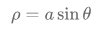

# 数学一复习

[TOC]

## 1. 各类常见曲线

| number | function                                              | name         |
| ------ | ----------------------------------------------------- | ------------ |
| 1      |  | 心脏形曲线   |
| 2      |  | 无穷形曲线   |
| 3      |  | 圆形曲线     |
| 4      |  | 圆形曲线     |
| 5      |  | 摆线         |
| 6      |  | 星形曲线     |
| 7      |  | 阿基米德螺线 |

